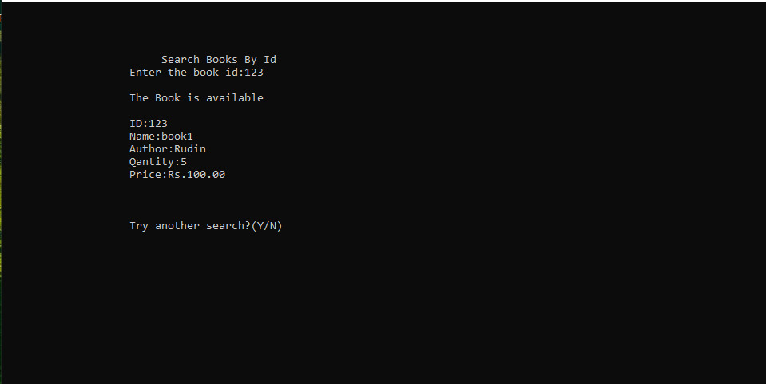

# Library Management System in C 
Course: CS3101

Github Repo: https://github.com/Ananyapam7/Library_System

Website: https://ananyapam7.github.io/Library_System/

##### Requirements:
Design an interactive library system in C programming language. It should have two modes of access (i) Admin and (ii) User. There should be unique login ids for each. The system should ask for the login id and check it against a list. The admin and user ids for a person should be different. A person without a valid id should not be allowed to access the library. An Admin should typically be the librarian (or others responsible for the library). Users can be students or faculties.

The allowed operations for each of these modes are:
Admin: Addition, deletion and updation of book records
User: Acquiring and returning of books


Each book should have a unique id, number of copies available, title, author, publisher etc. Each issue of a book should be recorded as well. The number of days for which a book can be borrowed should be dependent on the availability (more number of days for the books with a higher number of copies available). Also, there should be an upper limit on the number of books one can acquire at the same time. Books with less than 3 copies should be issued only to faculties.

The system should have an interactive interface. It should show the current status of the availability and assign books accordingly. It should also take back books. The library database should be updated accordingly. It should also give the aforementioned rights to the admin.

In addition, a search facility should be present for both these modes allowing free-text search in general and also for specific fields of a book.

## Documentation
This code is written on Windows 10 operating system and is compiled using the gcc compiler provided by Dev C++. Since the code used windows.h as a header for defining the gotoxy() function, it will not compile on linux systems.

### Header Files and standard functions
### <windows.h>
Structures and Functions
1. COORD = {x,y} - Defines the coordinates of a character cell in a console screen buffer
2. SetConsoleCursorPosition() - Function for setting the console in the required position.

### <conio.h>
1. getch() - It reads character from keyboard
2. getche() - It reads character from keyboard and displays the outpu on the output screen

### <stdio.h>
1. printf() - This function is used to print the character, string, float, integer, octal and hexadecimal values onto the output screen
2. scanf() - This function is used to read a character, string, numeric data from keyboard.
3. fopen() - This function is used to open a file to perform various operations which include reading, writing etc. along with various modes. If the file exists then the particular file is opened else a new file is created.
4. fclose() - Closes an opened file
5. putch()  - Writes a character to file
6. fseek()	- Moves file pointer position to given location
7. SEEK_CUR	- Moves file pointer position to given location
8. SEEK_END	- Moves file pointer position to the end of file
9. ftell() -	Gives current position of file pointer
10. rewind() -	Moves file pointer position to the beginning of the file
11. remove() - 	Deletes a file
12. fflush() - Flushes a file

### <stdlib.h>
1. exit(0) - For exiting the program and closing the application.

### <string.h>
1. strcmp(str1, str2) - Used for comparing two strings. Returns 0 if str1 is same as str2. Returns <0 if strl < str2. Returns >0 if str1 > str2

### Global Files

```C
FILE *fp,*ft,*fs;
```
These are the 3 files that are accessible globally. ft is used a temporary file. fp is used as the file which handles the "library.dat file". fs is used for keeping track of the issued books in the "Issued.dat" file.

### Control Flow
The system begins by calling password() which then checks if the person is a user or an admin by verifying a valid username and password and opens the menu accordingly.

### void password()
This function is used by the admin and user to login into system. They are required to enter user id and password before they are allowed to enter the system .The user id and password will be verified and if invalid id is there user or admin is  not allowed to enter in the system.
If valid username and password is entered by the user and admin, they will be allowed to go to the usermenu and adminmenu respectively. Note that this is not a secure way of entering passwords as no hashing has been used and hence should not be implimented in commercial systems.
```C
void password(void) 
{
system("cls");
char ch,pass[10];
char username[20];
int i=0,j,iter=0;
gotoxy(15,7);
printf("Enter Username: ");
scanf("%s",username);
gotoxy(15,9);
printf("Enter Password: ");
while(ch!=13)
{
ch=getch();
if(ch!=13 && ch!=8){
putch('*');
pass[i] = ch;
i++;
}
}
pass[i] = '\0';
if((strcmp(pass,pass_admin)==0)&&(strcmp(username,id_admin)==0))
{
system("cls");
gotoxy(17,9);
printf("Password match");
gotoxy(17,10);
printf("Press any key to countinue.....");
getch();
adminmenu();
}
if((strcmp(username,id_user)==0)&&(strcmp(pass,pass_user)==0))
{   
    system("cls");
    gotoxy(17,9);
    printf("Password match");
    gotoxy(17,10);
    printf("Press any key to continue.....");
    getch(); 
    usermenu();
}
else
{
gotoxy(15,16);
printf("\aWarning!! Incorrect Username or password");
getch();
password();
}
}
```


### void usermenu()
This function will be called after the user logs in the system. It has two functions inside it. 


### void issuebooks()
This function is used to issue books from the library database. It doesn't take any argument and doesn't return any value. We use a while loop to keep using this functionality as many times as we want, the loop uses the a character string as control. When the value of the string is 'y', the loop runs, and when not, it terminates. At the end of each execution of the loop body, the function asks for a value of this control string in the console using getche(), the user enters 'y' or 'n' as instructed by the line displayed in console, and the loop body is executed or not entered accordingly.
The purpose of this while loop is to check the book Id entered by the user in console against the library database file and verify if the Id is there in the database. If not, the function will display "No record found" on console, otherwise it will proceed to display "The book record is available" on console, and will also display the name and number of copies of the book available in the library. It will also display the date of issue , and due date for return along with a message "The BOOK of ID * is issued" with the Id of the book in the blanks. 
The due date will be given according to number of copies available (3 x the copies available), and number of copies available in library will be decreased by 1 once a book is issued.


### void returnbooks()
This function is used to return issued books to the library database. It doesn't take any argument, and doesn't return any value. We use a while loop to keep using this functionality as many times as we want, the loop uses the a character string as control. When the value of the string is 'y', the loop runs, and when not, it terminates. At the end of each execution of the loop body, the function asks for a value of this control string in the console using getch(), the user enters 'y' or 'n' as instructed by the line displayed in console, and the loop body is executed or not entered accordingly.
The purpose of this while loop is to check the book Id entered by the user in console against the library database file and verify if the Id is there in the database. If not, the function will display "No record is found" on console, otherwise it will proceed to increase the quantity of books of given Id by 1 in database, and display a message about the return being successful.


### void adminmenu()
This function will is called after the admin enters valid credentials to log in to the system to further use the following functions :
1. Add Books
2. Delete Books
3. Search Books
4. View Book List
5. Update Book's Record
6. Closing the application


### void addbooks()
This function is accessible to admin only. To access this function the admin needs to input the number preceding "Add Books" (in this case 1) in the MAIN MENU. After chosing "Add Books", input "Book ID"(integer type), Book Name, Author, Quantity and Price. The information of the books is stored in the binary file "library_file.dat".
```C
void addbooks(void)
{
system("cls");
int i;
system("cls");
fp=fopen("library_file.dat","ab+");
if(getdata()==1)
{
fseek(fp,0,SEEK_END);
fwrite(&a,sizeof(a),1,fp);
fclose(fp);
gotoxy(21,14);
printf("The record is sucessfully saved");
gotoxy(21,15);
printf("Save any more?(Y / N):");
if(getch()=='n')
adminmenu();
else
system("cls");
addbooks();
}
}
```


##### void deletebooks()
This function is accessible to admin only. To access this function the admin needs to input the number preceding "Delete Books" (in this case 2) in the MAIN MENU. Afterwards enter the id of the book to be deleted. Hit "Y" to confirm deletion.
```C
void deletebooks()
{
system("cls");
int d;
char another='y';
while(another=='y')  //infinite loop
{
system("cls");
gotoxy(10,5);
printf("Enter the Book ID to  delete:");
scanf("%d",&d);
fp=fopen("library_file.dat","rb+");
rewind(fp);
while(fread(&a,sizeof(a),1,fp)==1)
{
if(a.id==d)
{
gotoxy(10,7);
printf("The book record is available");
gotoxy(10,8);
printf("Book name is %s",a.name);
findbook='t';
}
}
if(findbook!='t')
{
gotoxy(10,10);
printf("No record is found, press any key to return");
if(getch())
adminmenu();
}
if(findbook=='t' )
{
gotoxy(10,9);
printf("Do you want to delete it?(Y/N):");
if(getch()=='y')
{
ft=fopen("test.dat","wb+");  //temporary file for delete
rewind(fp);
while(fread(&a,sizeof(a),1,fp)==1)
{
if(a.id!=d)
{
fseek(ft,0,SEEK_CUR);
fwrite(&a,sizeof(a),1,ft); 
}                              
}
fclose(ft);
fclose(fp);
remove("library_file.dat");
rename("test.dat","library_file.dat");
fp=fopen("library_file.dat","rb+"); 
if(findbook=='t')
{
gotoxy(10,10);
printf("The record is sucessfully deleted");
gotoxy(10,11);
printf("Delete another record?(Y/N)");
}
}
else
adminmenu();
fflush(stdin);
another=getch();
}
}
gotoxy(10,15);
adminmenu();
}
```


### void searchbooks()
Searchbooks is the function that searches books by their ID or NAME. First it asks the user for the choice whether to search by name or by ID,then opens the file 'library_file.dat ' in reading mode and searches the book in the file (using switch we distinguish the cases'search by ID,and the case 'search by name), for the case 'search by ID ,it ask the user for ID, and check this with ID of books in file library_file.dat, if the check is successful, it returns the message "The Book is available", along with the id, name, auther, quantity, and price of the book,and assign 't' to variable Findbook, now if check is usuccessful ,checks the condition if(findbook!='t') and  returns 'No Record Found', and asks user for different search. 
```C

void searchbooks()
{
system("cls");
int d;
printf("Search Books");
gotoxy(20,10);
printf(" 1. Search By ID");
gotoxy(20,14);
printf(" 2. Search By Name");
gotoxy(15,20);
printf("Enter Your Choice");
fp=fopen("library_file.dat","rb+"); //open file for reading propose
rewind(fp);   //move pointer at the begining of file
switch(getch())
{
case '1':
{
system("cls");
gotoxy(25,4);
printf("Search Books By Id");
gotoxy(20,5);
printf("Enter the book id:");
scanf("%d",&d);
while(fread(&a,sizeof(a),1,fp)==1)
{
if(a.id==d)
{
gotoxy(20,7);
printf("The Book is available");
gotoxy(20,9);
printf("ID:%d",a.id);
gotoxy(20,10);
printf("Name:%s",a.name);
gotoxy(20,11);
printf("Author:%s ",a.author);
gotoxy(20,12);
printf("Qantity:%d ",a.quantity);
gotoxy(20,13);
printf("Price:Rs.%.2f",a.price);
findbook='t';
}

}
if(findbook!='t')  //checks whether conditiion enters inside loop or not
{
gotoxy(22,9);printf("\aNo Record Found");
}
gotoxy(20,17);
printf("Try another search?(Y/N)");
if(getch()=='y')
searchbooks();
else
adminmenu();
break;
}
case '2':
{
char s[15];
system("cls");
gotoxy(25,4);
printf("Search Books By Name");
gotoxy(20,5);
printf("Enter Book Name:");
scanf("%s",s);
int d=0;
while(fread(&a,sizeof(a),1,fp)==1)
{
if(strcmp(a.name,(s))==0) //checks whether a.name is equal to s or not
{
gotoxy(20,7);
printf("The Book is available");
gotoxy(20,9);
printf("ID:%d",a.id);
gotoxy(20,10);
printf("Name:%s",a.name);
gotoxy(20,11);
printf("Author:%s",a.author);
gotoxy(20,12);
printf("Quantity:%d",a.quantity);
gotoxy(20,13);
printf("Price:Rs.%.2f",a.price);
d++;
}
}
if(d==0)
{
gotoxy(22,9);printf("\aNo Record Found");
}
gotoxy(20,17);
printf("Try another search?(Y/N)");
if(getch()=='y')
searchbooks();
else
adminmenu();
break;
}
default :
getch();
searchbooks();
}
fclose(fp);
}
```


### void updatebooks()
This function is accesible to admin only. The admin needs to input the number preceding "Update Book's Record" (in this case 5) in the MAIN MENU. Then enter the id of the book to whose record need to be updated. Next, enter the new name (if it is desired to keep the previous name, enter the previous name), new author, new quantity and the new price.
```C
void editbooks(void)  
{
system("cls");
int c=0;
int d,e;
gotoxy(20,4);
printf("Update Books Section");
char another='y';
while(another=='y')
{
system("cls");
gotoxy(15,6);
printf("Enter Book Id to be Updateed:");
scanf("%d",&d);
fp=fopen("library_file.dat","rb+");
while(fread(&a,sizeof(a),1,fp)==1)
{
if(verifyid(d)==0)
{
gotoxy(15,7);
printf("The book is availble");
gotoxy(15,8);
printf("The Book ID:%d",a.id);
gotoxy(15,9);
printf("Enter new name:");scanf("%s",a.name);
gotoxy(15,10);
printf("Enter new Author:");scanf("%s",a.author);
gotoxy(15,11);
printf("Enter new quantity:");scanf("%d",&a.quantity);
gotoxy(15,12);
printf("Enter new price:");scanf("%f",&a.price);
gotoxy(15,14);
printf("The record is modified");
fseek(fp,ftell(fp)-sizeof(a),0);
fwrite(&a,sizeof(a),1,fp);
fclose(fp);
c=1;
}
if(c==0)
{
gotoxy(15,9);
printf("No record found");
}
}
gotoxy(15,16);
printf("Modify another Record?(Y/N)");
fflush(stdin);
another=getch() ;
}
returnfunc();
}
```


### Other User-Defined Functions

### void gotoxy (int x, int y)
This is used in various parts of the program to move the output cursor to different parts of the screen mainly for the aesthetics.
```C
COORD coord = {0, 0};
void gotoxy (int x, int y)
{
coord.X = x; coord.Y = y; // X and Y coordinates
SetConsoleCursorPosition(GetStdHandle(STD_OUTPUT_HANDLE), coord);
}
```
### void returnfunc()
```C
void returnfunc()
{
{
printf(" Press ENTER to return to main menu");
}
a:
if(getch()==13) //to allow only use of enter
adminmenu();
else
goto a;
}
```

### int verifyid(int t)  
This function is to check whether the book already exists in the library or not
```C
int verifyid(int t)  
{
rewind(fp);
while(fread(&a,sizeof(a),1,fp)==1)
if(a.id==t)
return 0;  //returns 0 if book exits
return 1; //return 1 if it not
}
```


### Structures Used

#### struct Date()
```C
struct Date
{
int mm,dd,yy;
};
```

#### struct books()
```C
struct books
{
int id;
char name[20];
char author[20];
int quantity;
float price;
int count;
struct Date issued;
struct Date duedate;
};
```

#### Contributors and Modularizations:
Divyanshu Kumar: Add(), Delete(), Documentation

Arundhati Roy: Issue(), Return(), Documentation

Sanwayee Biswas: Documentation, Debugging

Abhay Kumar: Structures, gotoxy(), Header files Documentation

Praful Rahangdale: Update(), Search(), verifyid(), Documentation, Debugging

Ananyapam De: All the above and the remaining functions, designing control flow of the code, ensuring succesful compilation, Debugging, Documentation

#### Citations:
1. Registered User: orbitz on https://cboard.cprogramming.com/ for void gotoxy()
2. https://stackoverflow.com/ for debugging help
3. Project Dev C++ for IDE
